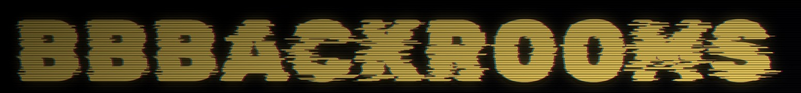

<p align="center">
  
</p>
<p align="center">
  <strong>bbbackrooms</strong> – Backrooms-style Multiplayer-Horror in der BBB Baden.
</p>
<p align="center">
  Bis zu 100 Schüler, patrouillierende Lehrer mit eigenen Fähigkeiten, Tasks lösen und in der Aula extrahieren.
</p>
<p align="center">
  <a href="docs/README.md"></a>
  <a href="docs/development.md"></a>
  <a href="docs/development.md"></a>
</p>

---

> Player-Tutorial im Spiel: Title-Screen → **HOW TO PLAY**. Diese README ist die Kurzfassung plus Run-Anleitung.

## Setup
- FastAPI-Backend serviert Worldgen, Lehrer-AI, Lobby und WebRTC-Signaling über WebSocket.
- Vite + Three.js Client rendert First-Person, baut Welt aus Server-Grid, hält WebRTC-Mesh für Webcam und Proximity Voice.
- Cloudflare TURN als Fallback für restriktive NATs (sonst STUN-only).

## Tasks
- Item-Tasks: Objekt am Pult suchen, mit **E** mitnehmen.
- Laptop-Tasks: Setzen, Mini-App lösen — Casino (Glück), Teams oder Moodle (Logik).
- Wenn alle Tasks fertig sind, öffnet sich der Extraction-Schacht in der Aula.

## Extraction
- Schacht in der Aula betreten — jeder extrahiert einzeln.
- Tote Mitspieler vorher mit Medkit wiederbeleben.
- Alle lebenden Spieler extrahiert → Sieg.

## Items
Vollständige Liste: [docs/items.md](docs/items.md).
- **Medkit** wiederbelebt liegende Mitspieler.
- **Trank** 8s Speedboost (Q).
- **Kompass** zeigt nächste Aufgabe.
- **Ortungsgerät** zeigt Tasks + Items auf der Minimap.
- **Wärmebild-Brille** 3s Lehrer-Reveal durch Wände (F, 30s Cooldown).
- **GPS Tracker** zeigt Lehrer permanent auf der Minimap.
- **Stuhl** aufheben + werfen → Lehrer ~3s gestunt.

## Controls
- **WASD** Bewegung, **Shift** Sprint, **Space** Springen.
- **E** Interagieren / Aufheben / Wiederbeleben.
- **Q** Trank trinken.
- **F** Wärmebild-Brille.
- **Linksklick** Stuhl werfen, **G** Stuhl ablegen.
- **V** Push-to-Talk (falls aktiviert).
- **X** Ping — markiert eine Stelle für das Team.

## Run

**Backend** (Python 3, FastAPI):
```powershell
cd server
python -m venv .venv
.\.venv\Scripts\Activate.ps1
pip install -r requirements.txt
.\run.ps1
```

**Frontend** (bun, nicht npm):
```powershell
cd client
bun install
bun run dev
```

Vite druckt die URL (Standard `http://localhost:5173`). Canvas klicken für Pointer-Lock. Volle Anleitung inkl. Docker und TURN-Setup: [docs/development.md](docs/development.md).

## Docs
- [Architecture](docs/architecture.md) — Server/Client-Split, Ordnerstruktur, Datenfluss.
- [Development](docs/development.md) — lokal laufen, `.env`, Docker Compose.
- [Protocol](docs/protocol.md) — WebSocket-Packets, WebRTC-Signaling, REST.
- [Worldgen](docs/worldgen.md) — Räume, Layout, Lehrer-AI.
- [Items](docs/items.md) — alle Pickups und ihre Effekte.

## Tips
- Bleibt zusammen — Wiederbeleben ist zuverlässiger als Soloplay.
- Proximity-Chat nutzen: Lehrer-Schritte sind hörbar, bevor man sie sieht.
- Lehrer hören euch auch: Sprinten, Stühle, Schliessfächer, Türen und Stimme locken sie an.
- Schliessfächer in der ganzen Schule durchsuchen — da liegen die Items.
- Casino-Laptops sind Glück, Teams/Moodle sind Logik — Plätze tauschen wenn ihr steckt.

## License
This project is licensed under the GPL-3.0 License. See the [LICENSE](LICENSE) file for details.

---
<p align="center">Made with ❤️ by <a href="https://github.com/Pianonic">PianoNic</a></p>
