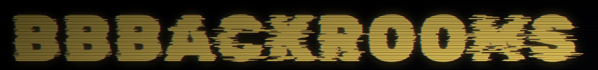

<p align="center">
  
</p>
<p align="center">
  <strong>Backrooms Baden</strong><br/>
  Backrooms-Horror in einer Schule in Baden. Tasks lösen, den Lehrern ausweichen, in der Aula raus.
</p>
<p align="center">
  <sub>Privates Hobbyprojekt ohne Verbindung zu einer realen Schule. Alle Lehrpersonen und Namen sind frei erfunden.</sub>
</p>
<p align="center">
  <a href="https://github.com/PianoNic/BackroomsBaden"></a>
  <a href="docs/development.md"></a>
  <a href="docs/README.md"></a>
  <a href="LICENSE.md"></a>
</p>

---

## Was ist Backrooms Baden?

Ein Multiplayer-Horrorspiel, das in einer Schule in Baden spielt. Bis zu 100 Schüler stecken in einer
Backrooms-Version der Schule fest, während patrouillierende Lehrer die Gänge ablaufen — jeder mit
seiner eigenen Fähigkeit.

Ihr löst gemeinsam Aufgaben: Objekte in Klassenzimmern suchen, an Laptops Casino-, Teams- oder
Moodle-Minigames lösen, und ein paar Tasks gehen nur zu zweit. Sind alle erledigt, öffnet sich der
Extraction-Schacht in der Aula — und ab da zählt nur noch, wer lebend rauskommt.

Die Lehrer sehen euch nicht nur, sie **hören** euch: Sprinten, geworfene Stühle, Türen und sogar
eure Stimme im Proximity-Chat ziehen sie an. Wer erwischt wird, bleibt liegen, bis jemand mit einem
Medkit vorbeikommt.

## Features

- **Bis zu 100 Spieler** pro Lobby, mit Proximity-Voice und optionaler Webcam über ein WebRTC-Mesh.
- **Lehrer mit Fähigkeiten**: jeder aus dem Roster hat eine eigene, von Gleichungs-Aura bis Hupe.
- **Noise-System**: Lehrer untersuchen Geräusche, statt nur stur zu patrouillieren.
- **Verstecken**: in Schränke schlüpfen (**E**) — solange kein Lehrer gerade zuschaut.
- **Prozedurale Schule**: jede Runde ein neues Layout, oder ein fixer Seed für alle.
- **Minigames**: Casino, Teams und Moodle als Laptop-Tasks, plus ein RPG-Battle.
- **Fortschritt**: Accounts über Google/Microsoft, XP, Level, Coins und 42 Cosmetics im Shop.
- **Achievements** mit Coin-Belohnungen und ein Scoreboard am Rundenende.
- **Ein Image**: FastAPI serviert API und Client zusammen — ein Container, ein Port.

## Loslegen

```powershell
docker compose up -d
```

Läuft dann auf `http://localhost:5367`. Lokale Entwicklung, `.env`-Variablen und TURN-Setup stehen
in [docs/development.md](docs/development.md).

- [Gameplay](docs/gameplay.md) — Tasks, Items, Controls, Tips.
- [Architecture](docs/architecture.md) — Server/Client-Split, Ordnerstruktur, Datenfluss.
- [Protocol](docs/protocol.md) — WebSocket-Packets, WebRTC-Signaling, REST.
- [Worldgen](docs/worldgen.md) — Räume, Layout, Lehrer-AI.

## License

[PolyForm Noncommercial 1.0.0](LICENSE.md). Copyright PianoNic.

Lesen, ändern und selbst hosten ist für jeden nichtkommerziellen Zweck erlaubt — der eigene Server,
die Klasse, eine Schule oder ein Verein. Kommerzielle Nutzung ist nicht lizenziert; verkaufen oder
als bezahlten Dienst betreiben braucht eine separate Vereinbarung. Source-available, nicht Open
Source.

---
<p align="center">Made with ❤️ by <a href="https://github.com/Pianonic">PianoNic</a></p>
