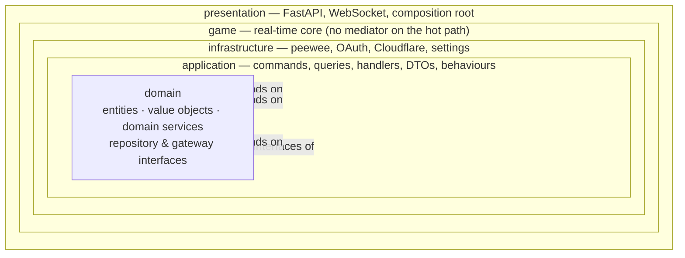

# Target architecture — clean/onion server with mediatorx

This document is the plan for restructuring `server/` into a clean (onion)
architecture using [`mediatorx`](https://pypi.org/project/mediatorx/), in an
OOP, C#-flavoured but PEP 8 compliant style. It describes the target, not the
current state; [architecture.md](architecture.md) keeps describing what is
actually shipped and is updated at the end of the migration.

The conventions below are taken from the same author's other Python services —
`SchulwareAPI` (the only one already on mediatorx), `ParkHereAPI`,
`ParkHereAuth` and `Llamarack` — so the server ends up looking like the rest of
the family rather than inventing its own dialect.

**Hard constraint:** the wire stays byte-identical. Every HTTP route, response
body, WebSocket packet name and payload shape is preserved. The client is not
touched by this work.

## The rings



Dependencies point **inwards only**. Concretely:

| Ring | May import | Must never import |
| --- | --- | --- |
| `domain` | stdlib, `app.domain` | anything else in `app`, FastAPI, peewee, httpx, pydantic |
| `application` | `app.domain`, `mediatorx`, pydantic (DTOs only) | `app.infrastructure`, `app.presentation`, `app.game`, FastAPI, peewee, httpx |
| `game` | `app.domain`, `app.application` (abstractions + messages) | `app.infrastructure`, `app.presentation` |
| `infrastructure` | `app.domain`, `app.application.abstractions`, any library | `app.presentation`, `app.game` |
| `presentation` | everything | — |

The single exception is the composition root
(`app/presentation/dependencies.py`), which is allowed — and required — to name
concrete infrastructure classes. Nothing else instantiates them.

`domain` depending on `WebSocket` (today `PlayerConn.ws: WebSocket`) is the one
inversion that has to be broken: the connection is modelled as an
`IPlayerChannel` interface in the domain, implemented by
`WebSocketPlayerChannel` in infrastructure. `send_json` / `send_text` are the
only two members the domain needs, which is exactly what the test `FakeWS`
already stands in for.

## Folder layout

```
server/app/
  domain/
    accounts/          Account, Profile, IAccountRepository, IProfileRepository
    achievements/      Achievement, AchievementCatalog, IAchievementRepository
    cosmetics/         CosmeticItem, CosmeticCatalog, ICosmeticRepository
    lobbies/           Lobby, PlayerConn, Chair, Door, Hideout, Laptop, Locker,
                       Pickup, Revive, ChatMessage, IPlayerChannel, ILobbyRegistry
    progression/       LevelCalculator, RewardCalculator, AchievementEvaluator
    security/          BlockedSubjectPolicy
    world/             WorldGenerator, RoomPlacer, Pathfinder, Physics,
                       TeacherAi, TeacherRoster, TeacherSpawner, layout/, …
    exceptions.py      DomainError and its subclasses
  application/
    abstractions/      IOAuthProvider, IOAuthProviderFactory, ITokenService,
                       IIceServerProvider, IUnitOfWork
    behaviors/         LoggingBehavior, ExceptionLoggingBehavior
    dtos/              *_dto.py — pydantic models on the way out
    commands/          *_command.py — command + its handler
    queries/           *_query.py — query + its handler
    notifications/     *_notification.py + notification handlers
  infrastructure/
    persistence/
      engine.py        the peewee-async database + pool
      models.py        peewee models (the ORM row shape, not the entity)
      migrations/      peewee-migrate scripts, unchanged
      repositories/    peewee_account_repository.py, peewee_profile_repository.py,
                       peewee_cosmetic_repository.py, peewee_achievement_repository.py
    oauth/             google_oauth_provider.py, microsoft_oauth_provider.py,
                       oauth_provider_factory.py
    realtime/          cloudflare_ice_server_provider.py,
                       web_socket_player_channel.py
    security/          hmac_token_service.py
    configuration/     settings.py — the pydantic-settings Settings class
  game/
    lobby_registry.py     in-memory ILobbyRegistry implementation
    packet_dispatcher.py  PacketDispatcher — the per-packet hot path
    broadcaster.py        Broadcaster — fan-out to a lobby's channels
    teacher_loop.py       TeacherLoop — the fixed-rate AI tick
    snapshot_loop.py      SnapshotLoop — batched players_state pushes
    handlers/             one class per interaction: ChairHandler, DoorHandler,
                          LockerHandler, PickupHandler, HidingHandler,
                          ReviveHandler, QuestHandler, LaptopHandler,
                          PingHandler, NoiseHandler, SignalingHandler,
                          CosmeticHandler
  presentation/
    controller.py      vendored class-based controller decorator (as SchulwareAPI)
    dependencies.py    composition root: build_mediator(), get_mediator(), …
    app_factory.py     create_app() — middleware, routers, static SPA, lifespan
    controllers/       health_controller.py, lobbies_controller.py,
                       auth_controller.py, shop_controller.py,
                       roster_controller.py, turn_controller.py
    websocket/         game_web_socket_endpoint.py
  asgi.py              unchanged ASGI entrypoint (Windows selector-loop guard)
  main.py              `app = create_app()` — kept so `app.main:app` still works
  version.py
```

`server/tests/` mirrors the layers: `tests/domain/`, `tests/application/`,
`tests/infrastructure/`, `tests/game/`, `tests/presentation/`.

## Conventions

### Files and classes
- **One public class per module.** The single exception, inherited from
  SchulwareAPI: a message and its handler live together, because they are one
  unit and are always imported together —
  `get_lobbies_query.py` holds `GetLobbiesQuery` **and** `GetLobbiesHandler`.
- Module names are the `snake_case` of the class they hold:
  `PeeweeAccountRepository` → `peewee_account_repository.py`.
- Interface modules drop the `I`: `IAccountRepository` lives in
  `account_repository.py`. Implementations are named after the technology that
  makes them concrete (`PeeweeAccountRepository`, `CloudflareIceServerProvider`,
  `HmacTokenService`).
- No `__init__.py` re-export walls; import from the defining module.

### Naming
- `PascalCase` classes, `snake_case` modules, functions, attributes and
  parameters, `SCREAMING_SNAKE_CASE` module constants — PEP 8 throughout.
- Abstractions carry an `I` prefix (`IAccountRepository`, `IOAuthProvider`,
  `IPlayerChannel`). This matches mediatorx's own surface (`ICommand`,
  `IQueryHandler`, `IPipelineBehavior`) and the C#-flavoured style asked for.
- Suffixes are load-bearing and never omitted: `…Command`, `…Query`,
  `…Handler`, `…Dto`, `…Repository`, `…Behavior`, `…Notification`, `…Policy`,
  `…Provider`, `…Service`.
- Commands mutate and are named imperatively (`BuyCosmeticCommand`); queries
  read and start with `Get`/`List` (`GetAccountQuery`, `ListLobbiesQuery`).

### Interfaces
Abstractions are `abc.ABC` with `@abstractmethod` members, not `Protocol`.
`ParkHereAPI` and `Llamarack` use `Protocol`; ABCs are chosen here because the
implementations are explicit, single-purpose classes that benefit from the
declared base and from failing loudly at construction when a member is missing.

```python
class IAccountRepository(ABC):
    @abstractmethod
    async def get_by_id(self, account_id: int) -> Account | None: ...

    @abstractmethod
    async def upsert(self, provider: str, subject: str, name: str | None) -> Account: ...
```

### Entities and DTOs
- Domain entities and value objects are `@dataclass` — `frozen=True` for value
  objects (`Account`, `CosmeticItem`, `Achievement`), mutable for the aggregates
  that carry live round state (`Lobby`, `PlayerConn`).
- DTOs are **pydantic** `BaseModel`s in `application/dtos/`, exactly as
  SchulwareAPI does (`AppInfoDto`). They are the only pydantic in the
  application ring, and the only shape the presentation ring returns.
- Because the wire must not change, DTOs use the existing camelCase field names
  (`maxPlayers`, `hasPassword`, `xpForNextLevel`) via `alias`/`serialization_alias`
  where they differ from the Python member name. Any DTO whose serialisation
  differs from today's dict is a bug.
- Peewee models stay in `infrastructure/persistence/models.py` and never leave
  the repository that owns them; repositories return domain entities.

### Dependency injection
Constructor injection, everywhere:

```python
class GetAccountHandler(IQueryHandler[GetAccountQuery, AccountDto | None]):
    def __init__(self, accounts: IAccountRepository, levels: LevelCalculator) -> None:
        self._accounts = accounts
        self._levels = levels
```

No module-level mutable state outside the composition root. The existing
module-level singletons that disappear:

| Today | Becomes |
| --- | --- |
| `app/domain/lobby_store.py::_lobbies` | `InMemoryLobbyRegistry` instance owned by the composition root |
| `app/services/turn.py::_cached` | instance state on `CloudflareIceServerProvider` |
| `app/db/engine.py::_ready` | instance state on `DatabaseEngine` |
| `app/config.py::BLOCKED_SUBJECTS` | `BlockedSubjectPolicy` built from `Settings` |
| `app/services/teacher_loop.py` / `snapshot.py` task dicts | fields on `TeacherLoop` / `SnapshotLoop`, held by the lobby |

`Settings` itself stays a process-wide instance (it is immutable configuration)
but is *injected*, never imported, by everything below presentation.

## Wiring the mediator into FastAPI

mediatorx resolves handlers through an `IResolver`. The default `DictResolver`
falls back to calling `handler_type()` with no arguments, which is exactly what
constructor injection rules out — so the composition root registers a factory
per handler. That factory *is* the DI container.

```python
def build_mediator(settings: Settings) -> Mediator:
    engine = DatabaseEngine(settings)
    accounts = PeeweeAccountRepository(engine)
    levels = LevelCalculator()

    resolver = DictResolver()
    resolver.add_factory(GetAccountHandler, lambda: GetAccountHandler(accounts, levels))
    resolver.add_instance(LoggingBehavior, LoggingBehavior())

    mediator = Mediator(resolver=resolver)
    mediator.register(GetAccountQuery, GetAccountHandler)
    mediator.add_behavior(LoggingBehavior)
    return mediator


_mediator = build_mediator(settings)


def get_mediator() -> Mediator:
    return _mediator
```

Controllers stay thin and are class-based, using the vendored `@controller`
decorator SchulwareAPI already carries, so the mediator is a class-level
`Depends`:

```python
router = APIRouter(tags=["App"])


@controller(router)
class HealthController:
    mediator: Mediator = Depends(get_mediator)

    @router.get("/version")
    async def version(self) -> VersionDto:
        return await self.mediator.send(GetVersionQuery())
```

The mediator object is process-wide and handed out through `Depends`, matching
SchulwareAPI. Handlers are stateless and their repositories wrap a pooled
connection, so a per-request mediator would only add allocation. Where a
handler genuinely needs per-request context (the session cookie, the caller's
account id), that context travels **in the message**, resolved by a small
FastAPI dependency (`get_current_account_id`) — never through ambient state.

### Pipeline behaviours
- `LoggingBehavior` — logs `message type → outcome, duration_ms` at debug, and
  is the reason handlers themselves stay silent.
- `ExceptionLoggingBehavior` — catches, logs with the message type as context,
  re-raises. Replaces the scattered `except Exception: log.warning(...)` blocks
  in the current routers.

Validation is *not* a behaviour: pydantic already validates at the FastAPI
boundary and `ClientPacketAdapter` already validates every inbound packet.
Adding a third validation pass would only duplicate it.

## What deliberately stays outside the mediator

| Stays direct | Why |
| --- | --- |
| Per-packet WebSocket dispatch (`move`, `chair_*`, `door_toggle`, `pickup_collect`, `hide`, `ping`, `voice_noise`, `webrtc_signal`, …) | Movement alone is tens of packets per second per player. A mediator `send` per packet adds a dict lookup, a resolver call, a behaviour chain and a log line to the tightest loop in the server, for no architectural gain — the dispatcher already routes a validated packet to exactly one handler object. |
| `TeacherLoop` and `SnapshotLoop` ticks | Fixed-rate background tasks, not requests. They have no caller to return a response to and must not be delayed by cross-cutting behaviours. |
| World generation | Pure CPU, run off the event loop with `asyncio.to_thread`. `WorldGenerator` is a domain service called by the `StartGameCommand` handler; the generation itself is not a message. |
| `Broadcaster` fan-out | A transport primitive, not a use case. |
| WebRTC signal relay | The server is a dumb pipe by design; the payload is never inspected. |

Everything else goes through the mediator: every HTTP endpoint, and the rare,
orchestration-shaped game events — `StartGameCommand`, `EndRoundCommand`,
`GrantRoundRewardsCommand`, `BackToLobbyCommand` — which fire at most a handful
of times per round and genuinely benefit from logging, transactions and
testability.

Round-end side effects that fan out (persist rewards, unlock achievements,
push the scoreboard) become mediatorx **notifications** published by
`EndRoundHandler`, so adding another consumer later does not touch the handler.

## Migration table

| Today | Target |
| --- | --- |
| `app/main.py` | `app/presentation/app_factory.py` (`create_app`); `app/main.py` keeps `app = create_app()` |
| `app/asgi.py` | unchanged |
| `app/version.py` | unchanged |
| `app/config.py` — `Settings` | `app/infrastructure/configuration/settings.py` |
| `app/config.py` — `BLOCKED_SUBJECTS`, `is_subject_blocked` | `app/domain/security/blocked_subject_policy.py` (`BlockedSubjectPolicy`) |
| `app/api/http.py` — `/healthz`, `/version` | `presentation/controllers/health_controller.py` + `GetVersionQuery` |
| `app/api/http.py` — `/lobbies` GET/POST | `presentation/controllers/lobbies_controller.py` + `ListLobbiesQuery`, `CreateLobbyCommand` |
| `app/api/http.py` — `/roster` | `presentation/controllers/roster_controller.py` + `GetTeacherRosterQuery` |
| `app/api/http.py` — `/turn-credentials` | `presentation/controllers/turn_controller.py` + `GetIceServersQuery` |
| `app/api/http.py` — `/shop/catalog` | `presentation/controllers/shop_controller.py` + `GetCosmeticCatalogQuery` |
| `app/api/auth.py` | `presentation/controllers/auth_controller.py` + `StartOAuthLoginCommand`, `CompleteOAuthLoginCommand`, `GetCurrentAccountQuery`, `LogoutCommand`, `DeleteAccountCommand`, `IssueWsTicketCommand`, `GetOAuthProvidersQuery` |
| `app/api/shop.py` | `presentation/controllers/shop_controller.py` + `GetShopStateQuery`, `BuyCosmeticCommand`, `EquipCosmeticCommand` |
| `app/api/ws.py` | `presentation/websocket/game_web_socket_endpoint.py` + `JoinLobbyCommand` |
| `app/api/ws_dispatch.py` | `game/packet_dispatcher.py` (`PacketDispatcher`) |
| `app/auth/oauth.py` | `infrastructure/oauth/` (`GoogleOAuthProvider`, `MicrosoftOAuthProvider`, `OAuthProviderFactory`) behind `IOAuthProvider` |
| `app/auth/tokens.py` | `infrastructure/security/hmac_token_service.py` behind `ITokenService` |
| `app/db/engine.py` | `infrastructure/persistence/engine.py` (`DatabaseEngine`) |
| `app/db/models.py`, `app/db/migrate.py`, `app/db/migrations/` | `infrastructure/persistence/` (paths preserved for peewee-migrate) |
| `app/db/accounts_repo.py` | `infrastructure/persistence/repositories/peewee_account_repository.py` + `peewee_profile_repository.py`, behind `IAccountRepository` / `IProfileRepository` |
| `app/db/cosmetics_repo.py` | `…/peewee_cosmetic_repository.py` behind `ICosmeticRepository` |
| `app/db/achievements_repo.py` | `…/peewee_achievement_repository.py` behind `IAchievementRepository` |
| `app/domain/lobby.py` | `domain/lobbies/` — one entity per module; `PlayerConn.channel: IPlayerChannel` replaces `ws: WebSocket` |
| `app/domain/lobby_store.py` | `domain/lobbies/lobby_registry.py` (`ILobbyRegistry`) + `game/lobby_registry.py` (`InMemoryLobbyRegistry`) |
| `app/domain/cosmetics.py` | `domain/cosmetics/` (`CosmeticItem`, `CosmeticCatalog`) |
| `app/domain/achievements.py` | `domain/achievements/` (`Achievement`, `AchievementCatalog`) |
| `app/schemas/packets.py`, `world.py`, `prop_types.py` | `application/dtos/packets/`, `application/dtos/world/` |
| `app/services/lobby_service.py` — `start_lobby` | `application/commands/start_game_command.py` (`StartGameHandler`) |
| `app/services/lobby_service.py` — `lobby_room_state`, `world_init_payload` | `application/dtos/lobby_state_dto.py`, `world_init_dto.py` + their builders in `game/` |
| `app/services/endgame.py` | `application/commands/end_round_command.py` + `RoundEndedNotification` handlers (`PersistRewardsHandler`, `UnlockAchievementsHandler`) |
| `app/services/scoreboard.py`, `leveling.py`, `achievements.py` | `domain/progression/` (`ScoreboardBuilder`, `LevelCalculator`, `RewardCalculator`, `AchievementEvaluator`) |
| `app/services/back_to_lobby.py` | `application/commands/back_to_lobby_command.py` |
| `app/services/shop.py` (WS path) | `game/handlers/cosmetic_handler.py` delegating to the same domain policy as the REST commands |
| `app/services/turn.py` | `infrastructure/realtime/cloudflare_ice_server_provider.py` behind `IIceServerProvider` |
| `app/services/broadcast.py`, `_helpers.py` | `game/broadcaster.py` (`Broadcaster`) |
| `app/services/teacher_loop.py`, `snapshot.py` | `game/teacher_loop.py`, `game/snapshot_loop.py` |
| `app/services/chairs.py`, `doors.py`, `lockers.py`, `pickups.py`, `hiding.py`, `revive.py`, `quests.py`, `pings.py`, `noise.py`, `laptop.py`, `signaling.py`, `abilities.py`, `status.py`, `_abilities_effects.py` | `game/handlers/` — one class each |
| `app/services/laptop_challenges.py`, `rpg_battle.py` | `domain/world/challenges/` (pure, seeded by an injected `random.Random`) |
| `app/world/**` | `app/domain/world/**` — package move, classes wrapped around the existing pure functions (`WorldGenerator`, `Pathfinder`, `Physics`, `TeacherAi`, `TeacherSpawner`, `TeacherRoster`) |
| `server/tests/*` | `server/tests/{domain,application,infrastructure,game,presentation}/` |

## Packaging and tooling

`mediatorx==1.0.1` is added to `server/requirements.txt`. The server has **no**
`pyproject.toml` and does not get one — the Dockerfile and CI both run
`pip install -r requirements.txt`, and the runtime image deliberately excludes
`requirements-dev.txt`. Local runs use `server/.venv`:

```powershell
cd server
.\.venv\Scripts\python.exe -m pytest -q
```

`Dockerfile` and `compose.yml` need no change: the entrypoint stays
`app.asgi:app` and migrations keep running as `python -m app.db.migrate run`
(the migrations package path is preserved for peewee-migrate).

## Staging

Each stage is one PR against `main`, squash-merged once CI is green, and each
keeps `pytest -q` passing and `docker build` working.

1. **Skeleton** — the five packages, `mediatorx` in `requirements.txt`, the
   `@controller` decorator, `build_mediator` / `get_mediator`, and `/healthz` +
   `/version` end-to-end through the mediator.
2. **Auth and accounts** — commands, queries and handlers for the whole
   `/auth/*` surface; `IAccountRepository` / `IProfileRepository` with their
   peewee implementations; OAuth providers behind `IOAuthProvider`;
   `BlockedSubjectPolicy`; `AuthController` becomes thin.
3. **Lobbies, shop, achievements, roster, TURN** — the remaining REST surface,
   `ICosmeticRepository`, `IAchievementRepository`, `IIceServerProvider`.
4. **Game orchestration** — `StartGameCommand`, `EndRoundCommand`,
   `GrantRoundRewardsCommand`, `BackToLobbyCommand`; the tick loops, teacher AI
   and packet dispatch move into `app/game` and `app/domain/world` as classes,
   with no mediator on the per-packet path.
5. **Cleanup** — delete `app/api`, `app/auth`, `app/db`, `app/services`,
   `app/schemas`, `app/world`; move tests to mirror the layers; refresh
   `architecture.md` and `development.md`.
